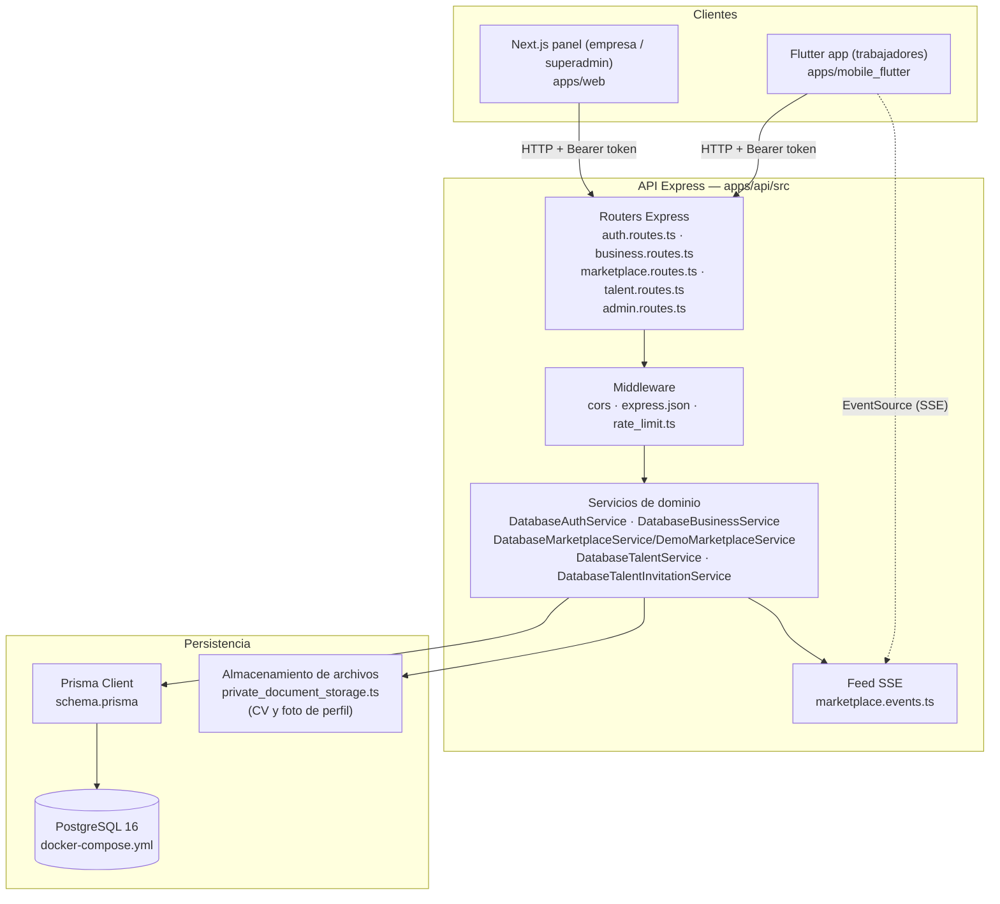
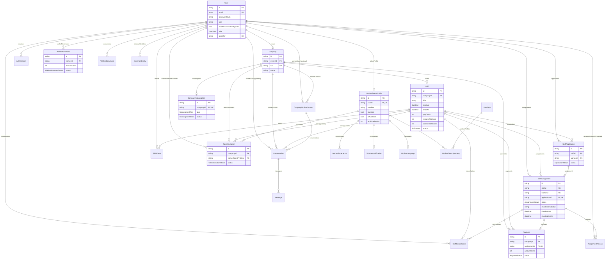

# Contexto técnico de Chambeaya (antes CumpleNow) — Documento de referencia para tesis

> Documento generado por análisis directo del código fuente del repositorio en
> `C:\xampp\htdocs\CumpleNow`, en el estado del branch `codex/modelo-negocio-simplificado`
> al 2026-09-17. Toda afirmación está respaldada por un archivo o comando concreto.
> Cuando algo descrito en `docs/` no tiene evidencia en el código, se marca
> explícitamente como **pendiente / no implementado**. No se incluyen funcionalidades
> supuestas ni lenguaje de marketing.

---

## 1. Resumen técnico del sistema

Chambeaya es una plataforma B2B de cobertura de turnos de trabajo temporal
("gig work" operativo, no un marketplace de freelancers). El código real
implementa tres clientes sobre una única API:

- **`apps/api`**: API REST en Node.js/Express + Prisma/PostgreSQL. Es la
  fuente de verdad; expone cinco routers montados en `apps/api/src/app.ts`:
  marketplace (`/api`), talento (`/api`), autenticación (`/api/auth`),
  negocio/empresa (`/api/business`) y administración (`/api/admin`).
- **`apps/web`**: panel Next.js 16 / React 19 para empresas
  (`apps/web/app/page.tsx`) y para superadministración
  (`apps/web/app/admin/page.tsx`).
- **`apps/mobile_flutter`**: aplicación Flutter para trabajadores
  (Android/iOS/web), con onboarding, autenticación (incluye Google Sign-In),
  descubrimiento de turnos, postulación, mensajería y perfil profesional.

El modelo de negocio real y vigente (según `docs/product/roadmap.md`,
verificado contra el código) es: la empresa publica turnos, el trabajador se
postula, la empresa selecciona, ambas partes coordinan asistencia
(confirmación → check-in → check-out) y el sistema registra el estado y un
historial de eventos (`ShiftEvent`). **No existe todavía** pago real,
verificación de identidad contra fuentes oficiales, ni intermediación laboral
formal: esto está documentado como fases futuras (Fase 4 a 7 del roadmap) y
confirmado ausente en el esquema de datos y en el código de negocio.

El proyecto tiene un **modo demo** explícito y separado del comportamiento
real: `DemoMarketplaceService` (`apps/api/src/modules/marketplace/marketplace.service.ts:103`)
coexiste con `DatabaseMarketplaceService` (línea 276) bajo la misma interfaz
`MarketplaceOperations`; el router usa `DatabaseMarketplaceService` por
defecto (`apps/api/src/modules/marketplace/marketplace.routes.ts:27`), y el
modo demo solo se activa explícitamente vía `CHAMBEAYA_DEMO_MODE=true` en
Flutter o mediante los scripts `apps/api/src/demo/demo.seed.ts` /
`demo.smoke.ts`.

---

## 2. Arquitectura del sistema

### 2.1 Patrón arquitectónico

El backend sigue una arquitectura en capas por módulo de dominio (no un
monolito por capas horizontales clásico ni microservicios):

- **Capa de transporte** (`*.routes.ts`): define endpoints Express, valida
  entrada con Zod y traduce errores de dominio a códigos HTTP.
- **Capa de servicio/dominio** (`*.service.ts`): contiene las reglas de
  negocio e interactúa con Prisma. Varios módulos definen una **interfaz**
  (`MarketplaceOperations`, `BusinessOperations`, `TalentOperations`) con
  implementaciones intercambiables (real contra PostgreSQL, o en memoria para
  demo/tests), lo que es un patrón de puerto/adaptador simplificado.
- **Capa de datos**: Prisma Client sobre PostgreSQL, con un único
  `schema.prisma` (`apps/api/prisma/schema.prisma`) como fuente de verdad del
  modelo de datos.

No hay ORM alternativo, ni cola de mensajes, ni cache (Redis, etc.) en el
código: las actualizaciones en tiempo real usan **Server-Sent Events (SSE)**
nativos de Express (`GET /api/shifts/events`,
`apps/api/src/modules/marketplace/marketplace.routes.ts:74`), no WebSockets.

### 2.2 Justificación de las tecnologías (evidencia + razón documentada)

| Tecnología | Evidencia | Justificación real encontrada en el repo |
| --- | --- | --- |
| **Express 5** | `apps/api/package.json` | API REST simple, sin necesidad de GraphQL; el equipo prioriza "flujo vertical completo" antes que infraestructura (`docs/product/roadmap.md:359`, "Microservicios o infraestructura distribuida prematura" está en la lista de lo pospuesto deliberadamente). |
| **Prisma + PostgreSQL** | `apps/api/prisma/schema.prisma`, `docker-compose.yml` | Modelo relacional con integridad referencial fuerte (turnos, postulaciones, pagos) y migraciones versionadas (23 migraciones reales en `apps/api/prisma/migrations/`). |
| **Zod** | usado en todos los `*.routes.ts` | Validación de esquemas de entrada en el borde HTTP, evita lógica de validación duplicada. |
| **SSE en vez de WebSockets** | `marketplace.routes.ts:74-110` | Decisión documentada explícitamente: "Mantener una actualización frecuente y tolerante a fallos [...] evolucionar a SSE/WebSocket cuando el volumen lo justifique" (`docs/product/roadmap.md:146`). |
| **Next.js 16 / React 19** | `apps/web/package.json` | Panel de escritorio para empresas y superadmin; SSR/CSR híbrido de Next para el panel administrativo. |
| **Flutter (Dart)** | `apps/mobile_flutter/pubspec.yaml` | Un solo código base para Android, iOS y web, priorizado porque "diseñar primero móvil para trabajadores" es una regla de UI/UX documentada (`docs/product/roadmap.md:292`). |
| **Docker Compose** | `docker-compose.yml` | Tres servicios (`db`, `api`, `web`) con healthchecks; entorno reproducible local y de despliegue (`docs/guides/deployment.md`). |
| **Vitest / Playwright / flutter_test** | `apps/api/package.json`, `apps/web/package.json`, `.github/workflows/*.yml` | Un framework de test nativo por stack, sin capa de abstracción común. |

### 2.3 Diagrama de capas



---

## 3. Modelo de datos

Fuente única: `apps/api/prisma/schema.prisma` (633 líneas), 23 migraciones
aplicadas de forma incremental (`apps/api/prisma/migrations/`, desde
`20260822151500_persistent_auth` hasta `20260916120000_worker_profile_sections`).

### 3.1 Enumeraciones reales

`UserRole` (WORKER, BUSINESS, ADMIN), `ShiftStatus`, `WorkerStatus`,
`ConversationStatus`, `MessageSender`, `PaymentStatus`,
`WalletMovementStatus`, `ApplicationStatus`, `AssignmentStatus`,
`CancellationActorRole`, `SubscriptionPlan` (PILOT, PRO, CUSTOM),
`SubscriptionStatus`, `ShiftEventType`, `ShiftEventActorRole`,
`ReviewAuthorRole`, `SpecialtyProficiency`, `WorkerDocumentKind`,
`ExternalIdentityProvider` (solo GOOGLE), `TalentInvitationStatus`,
`LanguageProficiency`.

### 3.2 Diagrama entidad-relación (reconstruido del schema real)



### 3.3 Notas de diseño relevantes verificadas en el schema

- `WorkerCertification` **no tiene ningún campo de verificación** (comentario
  explícito en el schema, líneas 422-427: "nunca se marca ni se muestra como
  verificada"), coherente con la regla de producto de no mostrar afirmaciones
  sin evidencia.
- `CompanyWorkerContact` (mapeado a la tabla `WorkerProfile` vía
  `@@map("WorkerProfile")`, línea 363) es un contacto interno de la empresa,
  **distinto** de `WorkerTalentProfile` (el perfil profesional global del
  trabajador). Esta separación es el resultado de un ítem cerrado del plan
  maestro ("Separar perfil global de contacto empresarial").
  `Conversation.workerId` referencia `CompanyWorkerContact`, no `User`
  directamente; `workerUserId` es el vínculo opcional al usuario real.
- `GoogleProfileSetup` es un estado intermedio de un solo uso (token
  hasheado con expiración) entre validar Google y pedir DNI/contraseña; el
  comentario del schema aclara que "no almacena ningún ID token de Google"
  (líneas 548-550).

---

## 4. Módulos y funcionalidades implementadas

Inventario de endpoints reales (`apps/api/src/app.ts` monta los routers) y su
cobertura de pruebas correspondiente en `apps/api/tests/`.

### 4.1 Autenticación — `/api/auth` (`auth.routes.ts`, `auth.service.ts`)

| Endpoint | Método | Tests |
| --- | --- | --- |
| `/register` | POST | `auth.routes.test.ts`, `auth.service.test.ts` |
| `/login` | POST | ídem |
| `/providers` | GET | ídem |
| `/google` | POST | `google_auth.service.test.ts`, `google_identity.test.ts` |
| `/google/complete` | POST | ídem |
| `/password` | POST | `auth.routes.test.ts` |
| `/session` | GET/DELETE | ídem |

Autenticación por contraseña con hash `scrypt` + salt (`node:crypto`,
`auth.service.ts:1-6`), sesiones persistidas en `AuthSession` con token
hasheado, y flujo de Google Sign-In con estado intermedio
(`GoogleProfileSetup`) para exigir DNI/contraseña propia antes de habilitar
la cuenta. Rate limiting propio en las rutas de auth
(`apps/api/src/middleware/rate_limit.ts`, probado en `rate_limit.test.ts`).

### 4.2 Marketplace (trabajador) — `/api` (`marketplace.routes.ts`, `marketplace.service.ts`)

| Endpoint | Método | Tests |
| --- | --- | --- |
| `/shifts` | GET | `marketplace.routes.test.ts`, `shift_search.test.ts` |
| `/shifts/events` (SSE) | GET | `marketplace.events.test.ts` |
| `/shifts/active` | GET | `marketplace.routes.test.ts` |
| `/workers/applications` | GET | ídem |
| `/workers/conversations` (+ `:id`, mensajes) | GET/POST | ídem |
| `/workers/payments/:id/confirm` | POST | ídem |
| `/shifts/:id/applications` | POST | ídem |
| `/shifts/:id/confirm` | POST | ídem |
| `/shifts/:id/check-in` | POST | ídem |
| `/shifts/:id/check-out` | POST | ídem |
| `/shifts/:id/cancel` | POST | ídem |
| `/shifts/:id/accept` | PUT | ídem |
| `/workers/availability` | GET/PUT | ídem |
| `/workers/wallet` | GET | ídem |

Implementa dos servicios intercambiables bajo `MarketplaceOperations`:
`DemoMarketplaceService` (en memoria, para demo/presentación) y
`DatabaseMarketplaceService` (Prisma real, usado por defecto). La transición
de estados de turno usa una máquina de estados compartida
(`apps/api/src/modules/operations/shift-state.ts`, probada en
`shift-state.test.ts`) y transacciones serializables para evitar
sobre-asignación de cupos (probado en
`tests/integration/shift-capacity-race.integration.test.ts`).

### 4.3 Empresa/negocio — `/api/business` (`business.routes.ts`, `business.service.ts`)

CRUD completo de: `company` (perfil de empresa), `subscription` (solo
lectura), `shifts` (crear/editar/eliminar/cancelar/ver postulaciones y
eventos), `workers` (contactos de empresa, `CompanyWorkerContact`),
`conversations` + `messages`, y `payments`. Cobertura:
`business.routes.test.ts`, `business.service.test.ts`.

### 4.4 Talento — `/api` (`talent.routes.ts`, `talent.service.ts`, `talent_invitation.service.ts`)

Perfil profesional global del trabajador (`GET/PATCH /workers/me/profile`),
subida/descarga de CV en PDF y foto de perfil (`PUT /workers/me/cv` y
`GET /workers/me/cv/download` —no hay `GET /workers/me/cv`—, `PUT/GET
/workers/me/photo`, con almacenamiento privado
en `private_document_storage.ts`), lectura del CV de un postulante por la
empresa dueña del turno
(`GET /business/shifts/:id/applications/:applicationId/cv`, solo lectura y
solo con postulación vigente y perfil visible; regla en `cv_access.ts`),
catálogo de especialidades
(`/specialties`), búsqueda de talento por empresa (`GET
/business/talent`), reseñas post-asignación (`POST
/assignments/:id/reviews`) e invitaciones de contacto empresa→trabajador
(`POST/GET /business/talent-invitations`,
`/workers/me/talent-invitations[/:id/accept|decline]`). Cobertura:
`talent.routes.test.ts`, `talent_invitations.routes.test.ts`.

### 4.5 Administración/superadmin — `/api/admin` (`admin.routes.ts`)

`GET /overview` (métricas agregadas), CRUD de `companies` (crear cuenta
empresarial manualmente — coherente con la regla de producto "la empresa no
se auto-registra"), `GET/DELETE /workers`, `GET /incidents`. Protegido por un
`guard` que exige `session.role === 'ADMIN'` (línea 49). Cobertura:
`admin.routes.test.ts`.

### 4.6 Módulos sin endpoint propio

`apps/api/src/modules/operations/shift-state.ts` no expone rutas; es lógica
de dominio pura (máquina de estados) consumida por `business.service.ts` y
`marketplace.service.ts`, probada en `shift-state.test.ts`.

### 4.7 Web (`apps/web`)

Solo dos páginas reales bajo `apps/web/app`: `page.tsx` (panel de empresa:
turnos, trabajadores/contactos, conversaciones, pagos) y `admin/page.tsx`
(panel superadmin). No hay página pública de registro/login de trabajador en
web (ese flujo vive solo en Flutter); `components/business-auth.tsx` cubre
login de empresa. Tests: Playwright en `apps/web/e2e/` (suite rápida con API
simulada: `business-auth.spec.ts`, `talent-invite.spec.ts`,
`talent-load-more.spec.ts`) y `apps/web/e2e-real/` (suite opcional contra API
y base de datos reales: `admin-worker-delete.spec.ts`).

### 4.8 Mobile (`apps/mobile_flutter`)

Features reales en `lib/features/`: `auth` (login/registro + Google
Sign-In), `onboarding`, `discovery` (búsqueda/filtros/alertas de turnos),
`marketplace` (postulación, confirmación, check-in/out, wallet, mensajería —
repositorio HTTP real en `http_worker_marketplace_repository.dart`),
`profile` (perfil de talento, invitaciones). El feature `company`
(`company_dashboard_page.dart`) **está enrutado** para el rol empresa
(`main.dart:153`) **pero no es funcionalidad real**: no hace ninguna llamada a
la API y muestra valores fijos escritos en el código (el nombre "Restaurante La
Mar" y `companyMetrics = CompanyMetrics(activeShifts: 18, coverage: 93,
onTime: 16)`, `marketplace_data.dart:289-293`). Es una pantalla de maqueta, no
un panel de empresa; el panel de empresa real es `apps/web`. 18 archivos de
test en `test/` (ver sección 8 para el archivo muerto `worker_pages.dart`).

---

## 5. Roles y flujos de usuario

Tres roles reales en `UserRole`: `WORKER`, `BUSINESS`, `ADMIN`. No existen
roles adicionales (p. ej. no hay "recruiter" ni "team member" de empresa —
`docs/product/roadmap.md:271` lista "roles y permisos para equipos
empresariales" como Fase 7, no implementada).

- **Trabajador (`WORKER`)**: se registra libremente desde Flutter
  (`POST /api/auth/register`), puede iniciar sesión con Google, completa su
  perfil profesional (`WorkerTalentProfile`), descubre turnos
  (`GET /api/shifts`), se postula (`POST /api/shifts/:id/applications`),
  espera decisión de la empresa, confirma, hace check-in/check-out,
  conversa con la empresa, y recibe invitaciones de contacto directo
  (`TalentInvitation`) que debe aceptar/rechazar explícitamente (crear una
  invitación **no** abre conversación automáticamente — regla documentada en
  el schema, línea 464-469, y verificable en `talent_invitation.service.ts`).
- **Empresa (`BUSINESS`)**: la cuenta la crea el superadmin
  (`POST /api/admin/companies`), no hay autoregistro público de empresa. Esto
  no es una omisión sino una regla aplicada en el código: `POST /api/auth/register`
  rechaza con `403 BUSINESS_REGISTRATION_DISABLED` cualquier cuerpo cuyo `role`
  no sea exactamente `'WORKER'` (`auth.routes.ts:32-34`), antes incluso de
  validar el resto de la entrada. La empresa publica turnos, revisa
  postulantes, decide, coordina vía mensajería, reporta pagos y consulta el
  historial de eventos de cada turno.
- **Administrador/superadmin (`ADMIN`)**: gestiona altas/bajas de empresas y
  trabajadores desde `apps/web/app/admin/page.tsx`, sin flujo de negocio
  propio más allá de moderación operativa.

---

## 6. Recursos técnicos utilizados

### 6.1 `apps/api` (`apps/api/package.json`)

- Node.js (LTS, sin versión fijada en `package.json`; CI de web usa Node 22
  vía `actions/setup-node`, `.github/workflows/web-tests.yml`)
- `@prisma/client` **6.12.0**, `prisma` **6.12.0** (dev)
- `express` **^5.0.0**
- `cors` **^2.8.5**
- `zod` **^3.24.0**
- `supertest` **^7.0.0**
- `vitest` **^4.1.11** (dev)
- `tsx` **^4.0.0** (dev), `typescript` **^5.0.0** (dev)
- `@types/*`: `cors` ^2.8.17, `express` ^5.0.0, `node` ^22.0.0, `supertest` ^6.0.2

### 6.2 `apps/web` (`apps/web/package.json`)

- `next` **^16.3.2**
- `react` / `react-dom` **^19.0.0**
- `lucide-react` **^1.33.0**
- `@playwright/test` **1.63.0** (dev)
- `typescript` **^5.0.0** (dev), `vitest` **^4.1.11** (dev)
- `@types/node` ^22.0.0, `@types/react` ^19.0.0, `@types/react-dom` ^19.0.0

### 6.3 `apps/mobile_flutter` (`apps/mobile_flutter/pubspec.yaml`)

- SDK Dart `^3.8.0`; Flutter estable **3.44.0** (fijado en CI,
  `.github/workflows/flutter-tests.yml`)
- `google_sign_in` **^7.2.0**, `google_sign_in_web` **^1.1.3**
- `http` **^1.2.2**
- `shared_preferences` **^2.5.3**
- `file_picker` **^13.0.0**
- `flutter_lints` **^6.0.0** (dev), `flutter_test` (SDK, dev)

### 6.4 Infraestructura y CI/CD

- **PostgreSQL 16-alpine** (imagen `postgres:16-alpine`, `docker-compose.yml`)
- **Docker Compose** con 3 servicios (`db`, `api`, `web`) y healthchecks
- **GitHub Actions**: dos workflows, `flutter-tests.yml` (analyze + test) y
  `web-tests.yml` (Playwright del panel + integración de API contra Postgres
  real en `services:`), con acciones de terceros fijadas por SHA completo
  (no por tag mutable).
- **Sin CI para `apps/api` unit tests por separado**: la suite unitaria de
  `apps/api` no tiene un job propio en `.github/workflows/`; solo el job
  `api-integration-tests` corre `npm run test:integration --workspace=@chambeaya/api`.
  Esto es una brecha real de cobertura de CI (ver sección 8).

### 6.5 Servicios externos configurados (`.env.example`)

- `GOOGLE_OAUTH_WEB_CLIENT_ID` / `..._SECRET` / `..._REDIRECT_URI` /
  `..._ANDROID_CLIENT_ID` / `..._IOS_CLIENT_ID`: variables presentes y
  **vacías por defecto**, comentario explícito "Preparados para una
  integración posterior; no activan proveedores por sí solos". El código de
  Google Sign-In sí está implementado (`google_auth.service.test.ts`,
  `google_identity.test.ts`), pero requiere credenciales reales para operar
  en producción.
- `DOCUMENT_STORAGE_DRIVER` / `DOCUMENT_STORAGE_BUCKET` /
  `DOCUMENT_STORAGE_ROOT`: variables de almacenamiento de documentos (CV,
  foto), driver vacío por defecto (almacenamiento local en disco,
  `private_document_storage.ts`).
- **No hay** variables de mapas/geolocalización, pasarela de pagos, ni
  notificaciones push en `.env.example`: estos servicios **no están
  configurados ni integrados**.

---

## 7. Historial y cronograma real de desarrollo

Reconstruido con `git log --reverse --format="%ad %h %s" --date=short`
(25 commits totales en el historial visible del branch actual). Las fechas y
los hashes de la tabla son literales; los asuntos aparecen **normalizados**
(tildes restituidas y algunos abreviados), por lo que el texto exacto de cada
commit es el que devuelve el comando anterior, no el de esta tabla.

| Fecha | Hash | Commit |
| --- | --- | --- |
| 2026-08-22 | `e192110` | chore: estado inicial de Cumple Now |
| 2026-08-22 | `9752708` | feat: agregar CRUD persistente empresarial |
| 2026-08-22 | `86c6bd0` | feat: enriquecer UI de descubrimiento Flutter |
| 2026-08-22 | `2cd657d` | feat: sincronizar turnos empresariales en tiempo real |
| 2026-09-04 | `4ac70d8` | chore: preparar despliegue de produccion |
| 2026-09-04 | `23367d7` | fix: separar acceso de superadmin del panel empresarial |
| 2026-09-04 | `1439bd6` | feat: suavizar animaciones del panel trabajador |
| 2026-09-04 | `349c7bd` | feat: agregar transiciones suaves a paneles web |
| 2026-09-04 | `ee1faf7` | fix: refrescar bundle de animaciones web |
| 2026-09-08 | `182449a` | feat: preparar demo reproducible para presentacion |
| 2026-09-08 | `79f8d5f` | test: validar recorrido demo de los tres roles |
| 2026-09-16 | `57d7c32` | chore: agregar flujo de agentes Claude Code |
| 2026-09-16 | `4417add` | ci: agregar workflows de GitHub Actions (SHA fijado) |
| 2026-09-16 | `4a205cd` | docs: reorganizar documentacion en guides/reference/product/archive |
| 2026-09-16 | `0cfdac0` | chore: propagar variables de CORS/rate limit a Docker |
| 2026-09-16 | `6d8c693` | feat(api): esquema/migraciones de talento, invitaciones y Google Sign-In |
| 2026-09-16 | `d5e2a31` | feat(api): módulo de talento (perfil, búsqueda, documentos, invitaciones) |
| 2026-09-16 | `e3e3673` | feat(api): Google Sign-In, rate limiting en auth y CORS por entorno |
| 2026-09-16 | `9e9fcb8` | feat(api): simplificar contacto empresa-trabajador y borrado en superadmin |
| 2026-09-16 | `49d51ab` | test(api): cobertura de talento, auth, admin, CORS, rate limit e integración |
| 2026-09-16 | `6eaba4c` | feat(web): directorio de talento, búsqueda, invitaciones y borrado seguro |
| 2026-09-16 | `d440f8f` | test(web): Playwright para talento, invitaciones y panel superadmin |
| 2026-09-16 | `99d59a8` | feat(mobile): perfil ampliado, invitaciones y Google Sign-In en Flutter |
| 2026-09-16 | `9548b62` | test(mobile): cobertura de perfil ampliado, invitaciones y navegación |
| 2026-09-16 | `9c061bc` | docs: registrar el ciclo de implementación y auditoría del refuerzo del piloto |

**Lectura del ritmo real (evidencia, no interpretación de marketing):**

- Cuatro sesiones de trabajo concentradas: **22 de agosto** (fundación:
  CRUD empresarial, UI Flutter, sincronización en tiempo real),
  **4 de septiembre** (separación de superadmin, animaciones UI),
  **8 de septiembre** (modo demo reproducible) y **16 de septiembre**
  (sesión más extensa: 14 de los 25 commits — esquema de talento completo,
  Google Sign-In, CI/CD, reorganización de `docs/`, e introducción del flujo
  de agentes Claude Code descrito en `CLAUDE.md`).
- El historial de `git log` por sí solo **no refleja el volumen real de
  trabajo**: `docs/PROGRESO.md` documenta un ciclo de auditoría iterativo
  (implementador → auditor → corrección → reauditoría) con IDs como
  `CN-20260916-093` a `CN-20260916-101` que ocurrieron dentro del mismo día
  16 de septiembre según las fechas de las entradas, pero no todos generan
  commits git individuales visibles en este listado (el registro operativo
  es más granular que el historial de commits).
- Las migraciones de Prisma (23 en total, sección 3) tienen timestamps en
  sus nombres que corroboran una progresión continua desde
  `20260822151500` hasta `20260916120000`, consistente con las fechas de
  commit.

---

## 8. Limitaciones y aspectos pendientes

### 8.1 Deuda técnica y huecos confirmados en el código

- **`apps/mobile_flutter/lib/features/marketplace/worker_pages.dart` es
  código muerto.** Confirmado por búsqueda: ningún archivo bajo `lib/`
  importa este archivo; su único importador en todo el repositorio es
  `apps/mobile_flutter/test/worker_flow_test.dart`, es decir, hay pruebas que
  ejercitan código que la aplicación real nunca ejecuta. Contiene lógica
  funcional (incluye texto "Pendiente de pago" en línea 715) pero no está
  enrutado desde `worker_shell.dart`.
  `docs/product/project-master-plan.md:74` lo señala como origen de 2 de los
  15 avisos `info` de `flutter analyze`. Su eliminación o reconexión está
  pendiente de una decisión explícita del usuario (documentado en
  `docs/PROGRESO.md`, entrada `CN-20260916-101`, "riesgo residual").
- **El "panel de empresa" de la app Flutter es una maqueta con datos fijos.**
  `company_dashboard_page.dart` sí está enrutado desde `main.dart:153` para el
  rol `BUSINESS`, pero no consulta la API: renderiza constantes del código
  (`companyMetrics`, `marketplace_data.dart:289-293`). Un usuario empresa que
  inicie sesión en la app móvil verá siempre las mismas cifras, ajenas a su
  cuenta. No debe contarse como funcionalidad de empresa implementada.
- **Un turno con check-in y sin check-out no tiene salida automática.**
  Hallazgo documentado en `docs/PROGRESO.md` (`CN-20260916-101`, "MEDIO-1
  preexistente"): `checkOut` (`marketplace.service.ts`) no tiene ventana de
  tiempo, por lo que una asignación puede quedar indefinidamente en
  `CHECKED_IN` si el trabajador nunca reporta salida; ni `updateShift` ni
  `cancelShift` pueden resolverlo. No hay cierre automático por inactividad
  implementado.
- **Sin job de CI dedicado a las pruebas unitarias de `apps/api`.**
  `.github/workflows/web-tests.yml` solo ejecuta
  `npm run test:integration --workspace=@chambeaya/api` (2 archivos en
  `tests/integration/`); los 19 archivos de test unitario en
  `apps/api/tests/` (auth, business, marketplace, talent, admin, cors,
  rate_limit, etc.) no tienen un job de CI propio que se ejecute
  automáticamente en cada push/PR — solo corren localmente vía `npm test`.
- **`DemoMarketplaceService` y `DatabaseMarketplaceService` pueden divergir sin
  que ninguna prueba lo detecte.** Ambas implementan la misma interfaz
  `MarketplaceOperations` (`marketplace.service.ts:69`, `:103`, `:276`), pero
  no existe ningún test de paridad de contrato que ejecute el mismo conjunto de
  casos contra las dos: el compilador solo obliga a que existan los métodos de
  la interfaz, no a que se comporten igual. Si una regla de negocio se corrige
  únicamente en la implementación real, la demo seguirá mostrando el
  comportamiento antiguo (y al revés) sin fallo visible en CI ni en local.
- **Rate limiting por IP es vulnerable detrás de un proxy sin configurar.**
  Documentado explícitamente en el propio código
  (`apps/api/src/app.ts:96-102`): si `API_TRUST_PROXY` no se configura en
  producción, todas las solicitudes comparten la IP del proxy inverso y,
  por lo tanto, un único cupo de intentos de login/registro.
- **CORS permisivo por defecto fuera de producción.** `resolveCorsOptions()`
  (`app.ts:43-62`) deja `cors()` sin restricción cuando
  `CORS_ALLOWED_ORIGINS` no está definida y `NODE_ENV !== 'production'`;
  solo en producción sin la variable se bloquea todo origen (comportamiento
  "fail closed" solo en producción, no en desarrollo/staging mal
  configurado).

### 8.2 Funcionalidad explícitamente pendiente / no implementada

Según `docs/product/roadmap.md` y `docs/product/project-master-plan.md`,
verificado contra la ausencia real de código/esquema correspondiente:

- **Pagos reales**: no existe integración con ninguna pasarela de pago; el
  modelo `Payment`/`WalletMovement` solo registra intención/estado
  (`PaymentStatus`: `PENDING`, `SCHEDULED`, `PROCESSED`, `CANCELLED`;
  `WalletMovementStatus`: `PENDING`, `RELEASED`, `REVERSED`), sin mover
  dinero real.
  Confirmado: no hay SDK de ningún PSP en ningún `package.json`.
  Fase 5/6 del roadmap ("Modelo económico sin mover dinero" /
  "Pagos y cumplimiento tributario controlados") están descritas como
  trabajo futuro, no implementado.
- **Verificación de identidad/empresa contra fuentes oficiales** (RENIEC,
  SUNAT, MTPE): no implementada. RUC y DNI se capturan como texto libre con
  formato validado (regex de 11 dígitos para RUC en
  `admin.routes.ts:19`), sin llamada a ningún servicio externo de
  verificación.
- **Geolocalización/mapas, cámara, GPS, biometría**: no hay ninguna
  dependencia de mapas (Google Maps, Mapbox, etc.) en `pubspec.yaml` ni en
  `.env.example`; `workRadiusKm`/`workDistricts` son campos de texto
  declarados por el trabajador, explícitamente documentados como "metadato
  informativo [...] no una regla de matching automática" (schema, línea
  378-380). Confirmado como pospuesto deliberadamente en el roadmap
  ("Seguimiento permanente por GPS", "Reconocimiento facial o huella
  digital propia").
- **Notificaciones push**: no hay SDK de Firebase Cloud Messaging, APNs, ni
  ningún paquete de notificaciones push en ningún `pubspec.yaml`/
  `package.json`. El único mecanismo de "tiempo real" es el feed SSE del
  marketplace y el polling periódico documentado (mensajería del panel web
  cada 4 segundos, `docs/product/roadmap.md:167`).
- **Roles/permisos de equipo dentro de una empresa** (multi-usuario por
  empresa): no implementado; `Company.ownerId` es único
  (`@@unique` implícito por ser `@unique` en el campo, schema línea 175),
  un solo usuario por empresa.
- **Auditoría completa de acciones sensibles, observabilidad/alertas,
  backups probados**: listados como Fase 7 ("Operación y plataforma de
  producción") en el roadmap, sin evidencia de implementación en el código
  (no hay integración de Sentry, Datadog, logging estructurado más allá de
  `console.error`, ni configuración de backups en `docker-compose.yml`).

### 8.3 Ausencia de marcadores formales de deuda técnica

Una búsqueda de `TODO|FIXME|HACK|XXX` en `apps/` no encontró comentarios de
deuda técnica explícitos en el código fuente (las coincidencias de
"pendiente" encontradas son en su mayoría texto de interfaz de usuario en
español, p. ej. estados de pago "Pendiente", no marcadores de deuda). La
deuda técnica real del proyecto está documentada de forma centralizada en
`docs/PROGRESO.md` y `docs/product/project-master-plan.md`, no dispersa en
comentarios de código.

---

## 9. Sostenibilidad y escalabilidad

Evaluación basada exclusivamente en decisiones de arquitectura verificables
en el código, no en proyecciones:

- **Escalabilidad horizontal del API**: la aplicación Express es stateless
  salvo por el feed SSE en memoria (`marketplace.events.ts`: una clase propia
  `MarketplaceShiftEvents` con un `Set` de listeners en el proceso, no un
  `EventEmitter` de Node ni un bus externo); esto significa que **el feed en tiempo
  real no escala a múltiples instancias del API sin un backplane
  compartido** (p. ej. Redis pub/sub), lo cual no está implementado. Para
  una sola instancia (adecuado al volumen de piloto actual, según
  `docker-compose.production.yml` de un solo contenedor `api`), es
  suficiente.
- **Integridad de datos bajo concurrencia**: el código usa transacciones
  serializables de Prisma (`withSerializableRetry` mencionado en
  `docs/PROGRESO.md` y verificable en `business.service.ts`) para evitar
  sobre-asignación de cupos en turnos con múltiples plazas, con una prueba
  de integración dedicada
  (`tests/integration/shift-capacity-race.integration.test.ts`). El control de
  concurrencia está, por tanto, en la base de datos y no en el proceso Node, que
  es la condición necesaria para correr varias instancias del API sin duplicar
  asignaciones; no hay medición de carga que respalde un límite concreto de
  volumen.
- **Separación demo/real** (`DemoMarketplaceService` vs
  `DatabaseMarketplaceService`) permite demostrar el producto sin
  comprometer datos reales, pero también implica que **dos implementaciones
  de la misma interfaz deben mantenerse sincronizadas en su contrato**
  (riesgo de divergencia si se agregan endpoints solo a una de las dos, no
  hay test que fuerce paridad automática entre ambas).
- **Migraciones incrementales y versionadas (no reversibles automáticamente)**:
  23 migraciones Prisma pequeñas y secuenciales (una por cambio de esquema, no
  migraciones monolíticas), versionadas junto con el código, lo que facilita la
  revisión de cada cambio de esquema. Precisión importante: cada carpeta de
  `apps/api/prisma/migrations/` contiene únicamente `migration.sql` (verificado:
  no existe ningún `down.sql`), así que **no hay rollback automático de
  esquema**; revertir exige escribir el SQL inverso a mano o restaurar un
  respaldo.
- **Dependencia de un único proveedor de identidad externo preparado
  (Google)**: el modelo `ExternalIdentityProvider` es un enum con un solo
  valor (`GOOGLE`), lo que sugiere que agregar otro proveedor (Apple, Meta)
  requeriría una migración de esquema, no solo configuración.
- **CI/CD parcial**: existen dos workflows de GitHub Actions con acciones
  fijadas por SHA (buena práctica de seguridad de la cadena de suministro),
  pero como se señaló en 8.1, la suite unitaria completa del API no corre en
  CI, lo que es un riesgo de sostenibilidad para detectar regresiones antes
  de producción.
- **Documentación operativa como parte del proceso de entrega**: el
  proyecto usa un flujo de agentes (`CLAUDE.md`, `docs/PROGRESO.md`) que
  obliga a registrar cada cambio con sus validaciones y a actualizar
  `docs/` en el mismo cierre que un cambio de comportamiento visible. El
  efecto verificable es que cada cierre deja registrado su alcance, sus
  validaciones y sus riesgos en `docs/PROGRESO.md` (107 entradas `### CN-…` al
  momento de este análisis); el flujo está activo desde el 16 de septiembre de 2026
  (commit `57d7c32`). No se afirma nada sobre su rendimiento comparado con
  otros proyectos: no hay base de comparación en el repositorio.

---

## Apéndice: comandos usados para esta reconstrucción

```
git log --reverse --format="%ad %h %s" --date=short
find apps/api/prisma/migrations -maxdepth 1 -type d
grep -rnE "router\.(get|post|patch|put|delete)\(" apps/api/src/modules/*/*.routes.ts
grep -rniE "TODO|FIXME|HACK|XXX|pendiente|no implementado" apps/
```

Todos los archivos citados existen en el repositorio al momento de este
análisis. Ningún dato de este documento proviene de inferencia sobre
funcionalidad "esperable"; donde el código y `docs/` no coincidían, se
verificó el código como fuente de verdad y se señaló la discrepancia.
